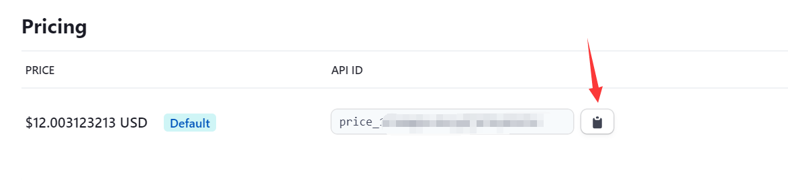
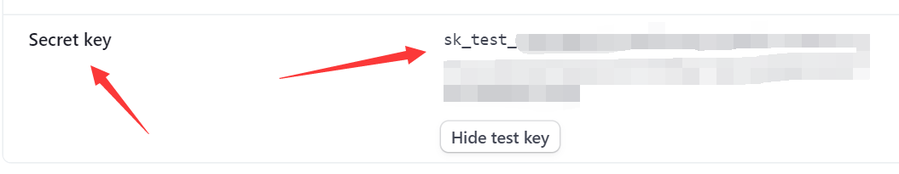
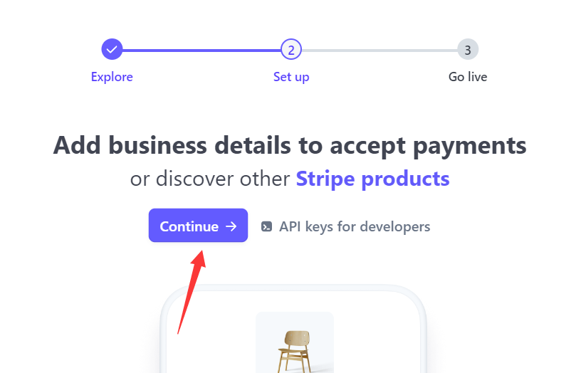

# Free Version Quick-Start

## 1. Place *CommerceTradeShop* mod in mods folder

* Place *CommerceTradeShop* mod in the mods folder

* Start the server

## 2. Stop server and setting Stripe

* When your server finished load *CommerceTradeShop* mod, stop your server
* Your minecraft server folders 'config/commercetradeshop/' will be like below
* 
## 3. Create your Stripe account and get your API key
* open [Stripe Website](https://stripe.com)
* 
* create a stripe account
* 

## 4. Create your product in Stripe(TEST)
* Try to create a product in Stripe
* 
* 
* 

***⬇⬇⬇___MAKE SURE ITS ONE-OFF___⬇⬇⬇***

* 
* Click your product page
* 
* Copy your product's price api id and store it in a place
* 

## 5. Test api(TEST)

* Copy your test api
* 
* 
* 
* Paste api in your `config/commercetradeshop/account.json`
* 

## 6. Create your shops

* Download the shop generator [ShopGenerator](ShopGenerator/shop.exe)
* Watch the video to learn [How to use ShopGenerator](ShopGenerator/ShopGenerator.mp4)
* The more details about shop json is in [ShopGeneratorDetails](../Details/ShopGenerator.md)
* Then put the json file into `config/commercetradeshop/shops`
* Last, start your server to preview use `/shop <your-json-file-name-which-is-also-shop-name>` just like `/shop free` which means shop's json file is free.json in the shops folder

## 7. Stripe recognize and Real trade

* When you get ready to have a real money trade:
  1. Continue to recognize your stripe account
  2. 
  3. 
  4. Remember to close the button and change your test api in `config/commercetradeshop/account.json` to the **REAL API**

## 8. For more detail
  1. Search the wiki
  2. [Add Discord Server](https://discord.gg/vVyGTSppQ7) 
  3. [Add Patreon VIP](https://www.patreon.com/breswii/membership)
